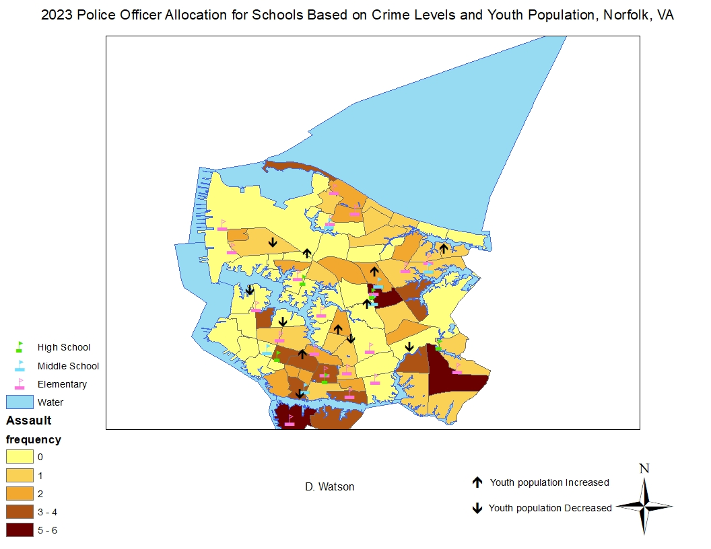

# Demontae Watson - Cybersecurity Portfolio

Welcome to my portfolio! I am currently a second-year Cybersecurity major with a minor in Data Science at Old Dominion University, expected to graduate in May 2027. Below are some of the projects I have worked on during my time in college. Feel free to explore my work, and don’t hesitate to reach out if you have any questions!

---

## Projects

### 1. Social Science & Crime Mapping
**Tools:** ArcGIS

I used ArcGIS to map various aspects of crime and social factors. These maps provide insights into how factors like poverty, police allocation, and natural disasters impact crime rates.

#### Maps:
- 
- 
- 
- 
- 
- 

---

### 2. Socket Programming - Secure Chat System
**Tools:** Python, Socket Programming

Developed a client-server communication system using Python socket programming. This system ensures secure messages, following cybersecurity principles.

[View Code on GitHub](https://github.com/WatsonDemontae/Server-Client-Secure-Chat)

---

## Research Papers

- **Essential Cybersecurity Measures in User Interface Design**  
Explores the critical design considerations needed to maintain security in user interfaces.

- **Penetration Testing: Safeguarding Networks**  
A paper that outlines the process and importance of penetration testing in securing networks.

---

## Contact Me
- **Email:** [dwats006@odu.edu](mailto:dwats006@odu.edu)
- **LinkedIn:** [Demontae Watson](https://www.linkedin.com/in/demontae-watson-8b61012b6/)

